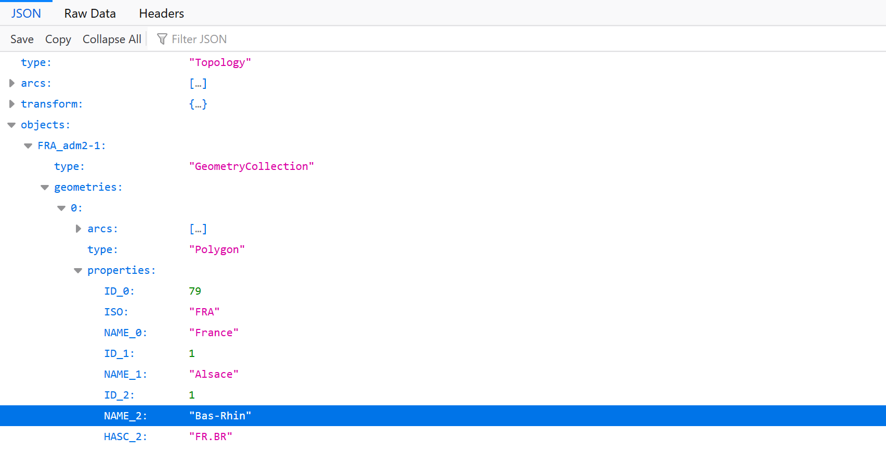

## Exemplar Visualisation 
[2017 French presidential election results](../index.html) is a visualisation created using this script. 

*[Online version](https://atharvat80.github.io/D3_Assignment/)*

## Tutorial
### 1. Prerequisites 
- [D3](https://d3js.org/) the javascript module and it's following submodules:
    - [D3 Queue](https://github.com/d3/d3-queue#d3-queue) 
    - D3 TopoJSON
    
    These can be linked directly in the HTML file of your visualisation (Shown in the template files further on in the tutorial)

- A Shapefile of your chosen geographical area (Make sure it includes data about the administrative levels you wish to visualise)
- Election results in CSV file format
- A JSON file that defines the colour scheme for the visualisation in a format shown below
    ```
    {
    "partyName_1": "#ffffff";
    "partyName_2": "#000000";

    ...

    }
    ```
- A HTML file to display the visualisation and a CSS file to define the styling of the visualisation (Templates can be found further on in the tutorial)

### 2. Creating the visualisation

#### 2.1 Convert your shapefile to a TopoJSON file for the visualisation
[Mapshaper](https://mapshaper.org/) is a simple online tool that can be used to convert shapefiles into TopoJSON format
1. Find and upload your shapefile by clicking the select button
1. Click import once the files have been uploaded
1. Wait for the preview to load and click export and make sure to select TopoJSON as the export format  
1. Follow [this](https://www.statsilk.com/maps/simplify-map-reducing-file-size-and-loading-time) article for details on simplifying the shapefile for faster processing

It helps to have basic understanding of the structure of a TopoJSON file as it is required to understand what arguments should be provided while initiating the visualisation, [this](https://www.spotzi.com/en/help-center/what-is-a-topojson/) article can be very useful in understanding that. 

For example, the [TopoJSON file](./france_2017/departements.json) used for the exemplar visualisation is structured like this



In this file ```objects:FRA_adm2-1``` contains data about all the french departements in the map and ```properties:NAME_2``` contains the name of the departement. Therefore, ```"FRA_adm2-1"``` and ```"NAME_2"``` have been passed as arguments while initiating the visualisation so the script can extract relevant data from the TopoJSON file.

Note: 
Other TopoJSON files have a similar format i.e. they all have a "objects" and "properties" attribute just with different sub-attributes so the program only need the name of the sub-attributes to extract relevant information.

#### 2.2 Create a suitable HTML and CSS file
A very basic template files are included below

##### Sample HTML file
```
<!DOCTYPE html>
<html>
    <head>
        <meta charset="UTF-8">
        <title>Page Title</title>
        <link href="/path/to/stylesheet.css" rel="stylesheet" type="text/css">

        <!-- get D3 scripts -->
        <script src="https://d3js.org/d3.v4.min.js"></script>
        <script src="https://d3js.org/d3-queue.v3.min.js"></script>
        <script src="https://d3js.org/topojson.v2.min.js"></script>

        <!-- get the script of the visualisation -->
        <script src="/path/to/script.js"></script>
        <!-- Can be linked using <script scr="https://raw.githubusercontent.com/atharvat80/D3_Assignment/master/script.js"></script> as well-->
    </head>
    
    <body>
        <!-- container for the visualisation -->
        <div id="map"></div>
        
        <!-- containers to display results  -->
        <p id="constituency" class="info"></p>
        <p id="result" class="info"></p>        
    
    </body>

</html> 
```    
Make sure that the HTML file contains two separate elements with ```id="constituency" class="info"``` and ```id="results class="info"``` as they are required to display results of an area when the user clicks on it.

##### Sample CSS file
```
.area {
  stroke: colour;
  stroke-width: width;
  // styling for the path elements that make up the map here
}

.info{
  // styling for the text that displays results here
}
```
Make sure to add classes called ```area``` and ```info``` to you CSS stylesheet as these define the styling for your map and the information that will be displayed

#### 2.3 Creating an instance of ```map```
Create an instance of class ```map``` and then initiate the visualisation by adding for example,
```
<script>
    var name = new map();
    name.init(
        "path/to/TopoJSON_file.json",
        "path/to/election_data.csv",
        "path/to/colourScheme.json", 
        "map",                      // id of the HTML tag the visualisation should be displayed in
                                    //"map" refers to the <div id="map"><div> element in the example HTML file
        "FRA_adm2-1",               // See section 2.1 of the tutorial
        "NAME_2",                   // See section 2.1 of the tutorial
        "constituency",             // Name of the column that contains name of the administrative levels of your data set
        "candidate",                // Name of the column that contains the name of the candidate
        "party",                    // Name of the column that contains the name of the party of the candidate
        scale                       // optional, 0.98 by default if not provided.
    );
</script>
```
to your HTML file. The visualisation should now show up after running the HTML file.

## License Information
This project is based on a [visualisation](https://bl.ocks.org/miguelrofer/ac1ec983fc8c1d0b8677259e6bb96198) by [Miguel Rofer](https://github.com/miguelrofer) and released under MIT license 

Copyright (c) 2020 [Atharva Tidke](https://github.com/atharvat80)

Permission is hereby granted, free of charge, to any person obtaining a copy of this software and associated documentation files (the "Software"), to deal in the Software without restriction, including without limitation the rights to use, copy, modify, merge, publish, distribute, sublicense, and/or sell copies of the Software, and to permit persons to whom the Software is furnished to do so, subject to the following conditions:

The above copyright notice and this permission notice shall be included in all copies or substantial portions of the Software.

THE SOFTWARE IS PROVIDED "AS IS", WITHOUT WARRANTY OF ANY KIND, EXPRESS OR IMPLIED, INCLUDING BUT NOT LIMITED TO THE WARRANTIES OF MERCHANTABILITY, FITNESS FOR A PARTICULAR PURPOSE AND NONINFRINGEMENT. IN NO EVENT SHALL THE AUTHORS OR COPYRIGHT HOLDERS BE LIABLE FOR ANY CLAIM, DAMAGES OR OTHER LIABILITY, WHETHER IN AN ACTION OF CONTRACT, TORT OR OTHERWISE, ARISING FROM, OUT OF OR IN CONNECTION WITH THE SOFTWARE OR THE USE OR OTHER DEALINGS IN THE SOFTWARE.